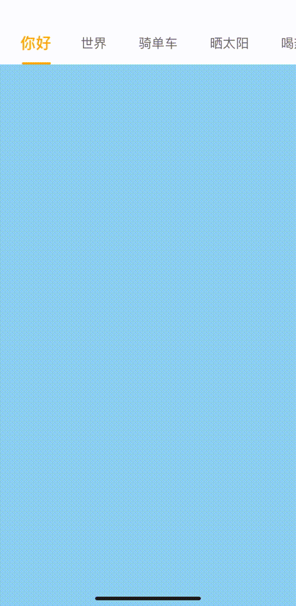
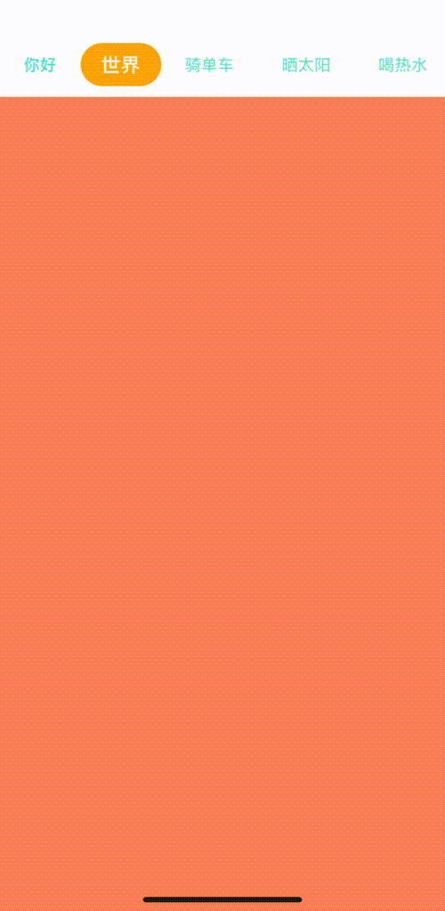

# 中文文档

[English](./README.md) | 中文

一个**高性能、高度可定制**的 React Native 选项卡/页面组件，具有流畅的动画和灵活的样式选项。使用 `react-native-reanimated` 构建，确保原生性能。

## ✨ 特性

- 🚀 **高性能**: 即使页面中有大量计算，动画依然流畅
- 🎨 **高度可定制**: 分离的 Header 和 Page 组件，完全控制
- 🔧 **灵活指示器**: 自定义指示器动画和样式
- 📱 **原生体验**: 使用 `react-native-reanimated` 实现 60fps 动画
- 🎯 **TypeScript 支持**: 完整的 TypeScript 支持和类型定义
- 🔄 **手势支持**: 流畅的平移手势和滚动交互
- 💎 **简洁 API**: 简单直观的组件结构

## 🚀 演示

在 Snack Expo 上试用在线演示：**[https://snack.expo.dev/@hublot/react-native-selected-page](https://snack.expo.dev/@hublot/react-native-selected-page)**

## 📦 安装

```bash
yarn add https://github.com/hellohublot/react-native-selected-page.git
```

## 🎯 基本用法



```tsx
import React from 'react';
import { View, Text } from 'react-native';
import { Tab } from 'react-native-selected-page';

const PAGES = [
  { title: 'Home', backgroundColor: 'skyblue' },
  { title: 'Profile', backgroundColor: 'coral' },
  { title: 'Settings', backgroundColor: 'pink' },
];

export default function App() {
  return (
    <View style={{ flex: 1, paddingTop: 80 }}>
      <Tab data={PAGES}>
        <Tab.Header 
          itemNormalStyle={{ paddingHorizontal: 10, fontSize: 18 }}
          indicatorWidth={0.5}
        />
        <Tab.Page
          renderItem={({ item }) => (
            <View style={{ flex: 1, backgroundColor: item.backgroundColor }}>
            </View>
          )}
        />
      </Tab>
    </View>
  );
}
```

## 🎨 高级定制



```tsx
function Page({item}) {
  for (let i = 0; i < 500000; i ++) {
    i += 1;
  }
  return (
    <View
      style={{
        flex: 1,
        backgroundColor: item.backgroundColor,
      }}
    >
    </View>
  )
}

function CustomHeader() {
  const { scrollX, headerItemLayouts, pageWidth, data } = React.useContext(TabContext);
  const indicatorWidth = 1
  const createStyle = (isMask) => {
    return useAnimatedStyle(() => {
      const pageProgress = Math.max(0, scrollX.value) / pageWidth;
      const currentPage = Math.floor(pageProgress);
      const nextPage = Math.min(currentPage + 1, data.length - 1);
      const progress = pageProgress - currentPage;

      const current = headerItemLayouts[currentPage];
      const next = headerItemLayouts[nextPage];

      const currentCenter = current.left + current.width / 2;
      const nextCenter = next.left + next.width / 2;

      let currentWidth, nextWidth;

      if (indicatorWidth <= 1) {
        currentWidth = current.width * indicatorWidth;
        nextWidth = next.width * indicatorWidth;
      } else {
        currentWidth = indicatorWidth;
        nextWidth = indicatorWidth;
      }

      const currentHalf = currentWidth / 2;
      const nextHalf = nextWidth / 2;

      let left, right;

      if (progress <= 0.5) {
        const rightStart = currentCenter + currentHalf;
        const rightEnd = nextCenter + nextHalf;
        right = rightStart + (rightEnd - rightStart) * (progress / 0.5);
        left = currentCenter - currentHalf;
      } else {
        const leftStart = currentCenter - currentHalf;
        const leftEnd = nextCenter - nextHalf;
        left = leftStart + (leftEnd - leftStart) * ((progress - 0.5) / 0.5);
        right = nextCenter + nextHalf;
      }

      const style = {
        position: 'absolute',
        bottom: 0,
        left,
        width: right - left,
      }

      return isMask ? {
        ...style,
        top: 0,
        backgroundColor: 'white'
      } : {
        ...style,
        top: 9,
        height: 40, 
        borderRadius: 20, 
        backgroundColor: 'orange'
      }
    })
  }
  const maskStyle = createStyle(true)
  const indicatorStyle = createStyle(false)
  return (
    <Tab.Header 
      style={{ backgroundColor: 'white' }}
      contentContainerStyle={{ paddingHorizontal: 0 }}
      itemNormalStyle={{ color: 'turquoise', paddingHorizontal: 10, fontSize: 15 }}
      renderIndicator={() => null}
      renderList={(value) => (
        <>
          { value }
          <Animated.View pointerEvents="none" style={indicatorStyle} />
          <View pointerEvents="none" style={StyleSheet.absoluteFill}>
            <MaskedView pointerEvents="none" style={[StyleSheet.absoluteFill, {flexDirection: 'row', backgroundColor: 'transparent' }]} maskElement={(
              <View pointerEvents="none" style={[StyleSheet.absoluteFill, { flexDirection: 'row', backgroundColor: 'transparent' }]}>
                {value}
              </View>
            )}>
              <Animated.View pointerEvents="none" style={maskStyle} />
            </MaskedView>
          </View>
        </>
      )}
    />
  )
}


export default function AdvancedApp() {
  return (
    <View style={{ flex: 1, paddingTop: 80 }}>
      <Tab data={PAGES}>
        <CustomHeader />
        <Tab data={PAGES}>
          <CustomHeader />
          <Tab.Page
            windowSize={2}
            renderItem={({ item }) => (
              <Page item={item} />
            )}
          />
        </Tab>
      </Tab>
    </View>
  );
}
```

## 🔥 高性能演示

即使在页面组件中有大量计算，动画依然保持流畅：

```tsx
function HighPerformancePage({ item }) {
  // 密集计算，通常会阻塞 UI
  for (let i = 0; i < 50000000; i++) {
    i += 1;
  }
  
  return (
    <View style={{ flex: 1, backgroundColor: item.backgroundColor }}>
      <Text style={{ fontSize: 20, textAlign: 'center', marginTop: 50 }}>
        🚀 即使有大量计算，动画依然流畅！
      </Text>
      <Text style={{ fontSize: 16, textAlign: 'center', marginTop: 20 }}>
        这个页面运行了 5000 万次迭代，但动画保持流畅
      </Text>
    </View>
  );
}

// 使用方式
<Tab.Page
  renderItem={({ item }) => <HighPerformancePage item={item} />}
/>
```

## 📖 API 参考

### Tab 组件

| 属性 | 类型 | 描述 |
|------|------|------|
| `data` | `Array<any>` | 页面数据对象数组 |
| `children` | `React.ReactNode` | Tab.Header 和 Tab.Page 组件 |

### Tab.Header 组件

| 属性 | 类型 | 默认值 | 描述 |
|------|------|--------|------|
| `indicatorWidth` | `number` | `1` | 指示器宽度（0-1 为百分比，>1 为固定宽度） |
| `itemNormalStyle` | `TextStyle` | `{}` | 普通标签项样式 |
| `itemSelectedStyle` | `TextStyle` | `{}` | 选中标签项样式 |
| `indicatorStyle` | `ViewStyle` | `{}` | 指示器样式 |
| `renderItem` | `Function` | `undefined` | 自定义标签项渲染函数 |
| `renderIndicator` | `Function` | `undefined` | 自定义指示器渲染函数 |
| `style` | `ViewStyle` | `{}` | 头部容器样式 |

### Tab.Page 组件

| 属性 | 类型 | 描述 |
|------|------|------|
| `renderItem` | `Function` | 渲染每个页面的函数 |
| `...FlatListProps` | `any` | 支持所有 FlatList 属性 |

## 🎭 定制化示例

### 自定义指示器

```tsx
<Tab.Header
  renderIndicator={({ scrollX, headerItemLayouts }) => (
    <Animated.View
      style={[
        {
          position: 'absolute',
          bottom: 0,
          height: 3,
          backgroundColor: 'orange',
          borderRadius: 1.5,
        },
        // 在这里添加你的自定义动画逻辑
      ]}
    />
  )}
/>
```

### 分离的 Header 和 Page

```tsx
<View style={{ flex: 1 }}>
  <Tab data={PAGES}>
    <Tab.Header />
  </Tab>
  
  {/* 中间的自定义内容 */}
  <View style={{ height: 50, backgroundColor: '#f0f0f0' }} />
  
  <Tab data={PAGES}>
    <Tab.Page renderItem={({ item }) => <YourPage item={item} />} />
  </Tab>
</View>
```

## 🤝 贡献

欢迎贡献！请随时提交 Pull Request。

## 📄 许可证

本项目采用 Apache License 2.0 许可证 - 查看 [LICENSE](LICENSE) 文件了解详情。

## 👨‍💻 作者

**hellohublot** - [hellohublot@gmail.com](mailto:hellohublot@gmail.com)
