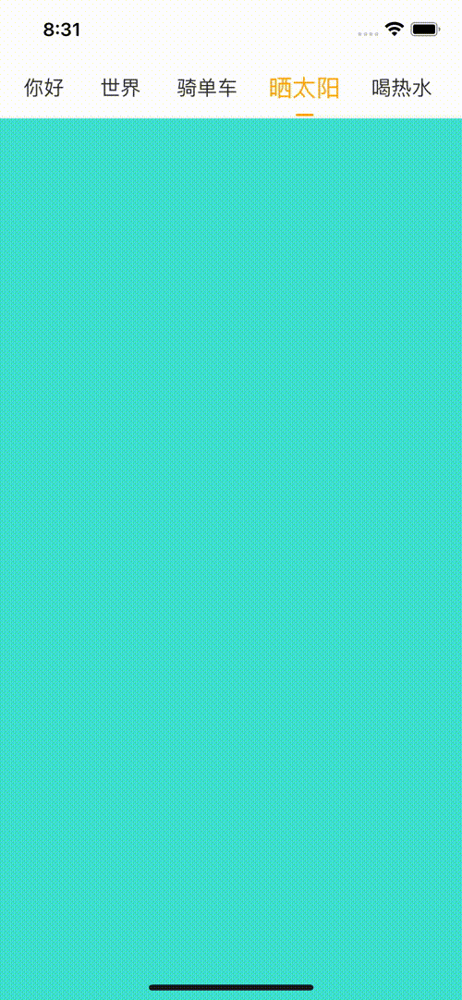

- 纯原生动画的导航栏, 文字放大, 文字颜色渐变和下面滚动条, 都是 Animated.Value + Animated.Event 原生动画
- 可以单独拆开使用, 比如 Header 和 Content 和 SelectedLabel 都可以单独使用
- 可以自定义每个 header.item



## Usage

[点击查看完整示例 Example](./example/App.js)

```bash
yarn add 'https://github.com/hellohublot/react-native-selected-page.git'
```

```javascript
import { HTPageHeaderView, HTPageContentView, HTPageManager, HTSelectedLabel } from 'react-native-selected-page'

this.pageManager = new HTPageManager([
	{ title: '你好', backgroundColor: 'skyblue' },
	{ title: '世界', backgroundColor: 'coral' },
	{ title: '骑单车', backgroundColor: 'pink' },
	{ title: '晒太阳', backgroundColor: 'turquoise' },
	{ title: '喝热水', backgroundColor: 'salmon' },
])

let Header = this.pageManager.renderHeaderView
let Content = this.pageManager.renderContentView

<Header 
	style={{ height: 50, backgroundColor: 'white', borderBottomColor: '#F5F5F5', borderBottomWidth: 1 }}
	titleFromItem={ item => item.title }
	initScrollIndex={ 0 }
	itemContainerStyle={{ paddingHorizontal: 10, marginLeft: 10 }}
	itemTitleStyle={{ fontSize: 17 }}
	itemTitleNormalStyle={{ color: '#333' }}
	itemTitleSelectedStyle= {{ color: 'orange', fontSize: 20}}
	cursorStyle={{ width: 15, height: 2, borderRadius: 1, backgroundColor: 'orange' }}
/>
<Content 
	initScrollIndex={ 0 }
	renderItem={({item, index}) => {
	return (
		<View style={{ flex: 1, backgroundColor: item.backgroundColor }}>
		</View>
	)}} 
/>

```

## Author

hellohublot, hublot@aliyun.com
